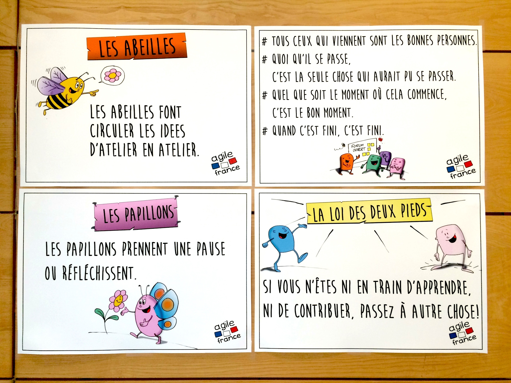
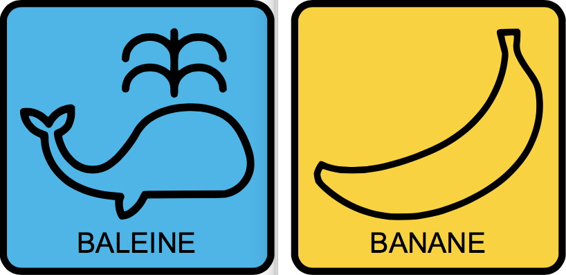
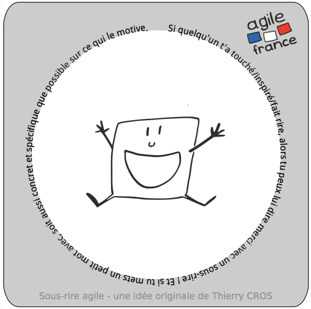

# Supports graphiques d'AgileFrance 2017

Les supports graphiques réalisés par Jean-Pierre Bonnafous à l'occasion de la conférence AgileFrance 2017.

## Contenu

### Forum ouvert

Pour toute activité de facilitation d'un forum ouvert, récapitulatif des règles à imprimer (de préférence en A2).

### Pictogrammes

Pour marquer chacun des lieux de rencontre lors d'un forum ouvert ou d'un barcamp.

### Sou-rire

Planches de sou-rire dessinés et préassemblés pour des impressions en A4. Pour faciliter les rencontres lors d'une (non-)conférence. Distribuez 5 à 10 sou-rire à chaque participant·e, qui a pour mission d'en offrir à chaque autre participant·e qui lui aura apporté quelque chose.

### Plans et programmes

Des exemples de panneaux, de plans et de programme peuvent vous aider à préparer votre conférence.

## Licence

Ces supports sont fournis sous une licence [CC-BY-NC-SA 4.0](https://creativecommons.org/licenses/by-nc-sa/4.0/deed.fr) « Jean-Pierre Bonnafous de l’équipe d’organisation de la conférence AgileFrance 2017 », c'est-à-dire que vous avez le droit de les imprimer, les diffuser et les modifier sous quelque forme que ce soit, dès lors que :

1. Vous en attribuez la source à « Jean-Pierre Bonnafous de l’équipe d’organisation de la conférence AgileFrance 2017 » (ou un équivalent donnant explicitement ce nom et ce contexte).
2. Si la diffusion se fait sur un support électronique, vous faites un lien vers ce dépôt.
3. Vous ne monétisez pas cette diffusion.
4. Vous redistribuez vos améliorations à des conditions équivalentes à celles-ci.

## Pourquoi diffuser ces supports ?

L'association AgileFrance ayant pour objet de soutenir la diffusion non-marchande des pratiques de l'agilité, il nous a semblé pertinent de faciliter la réutilisation de ces supports de grande qualité produits bénévolement par Jean-Pierre Bonnafous avec l'aide de @JulienPorot à l'occasion de la conférence AgileFrance 2017.
En tant que membre de l'association AgileFrance, @MattiSG a donc consolidé et fourni ces supports sous une licence libre (avec évidemment l'accord des auteurs) pour que la communauté agiliste francophone puisse s'en emparer.

Nous espérons ainsi faciliter la diffusion des bonnes pratiques éprouvées que sont le forum ouvert et les sous-rires, et donner plus facilement un aspect professionnel aux événements communautaires.
